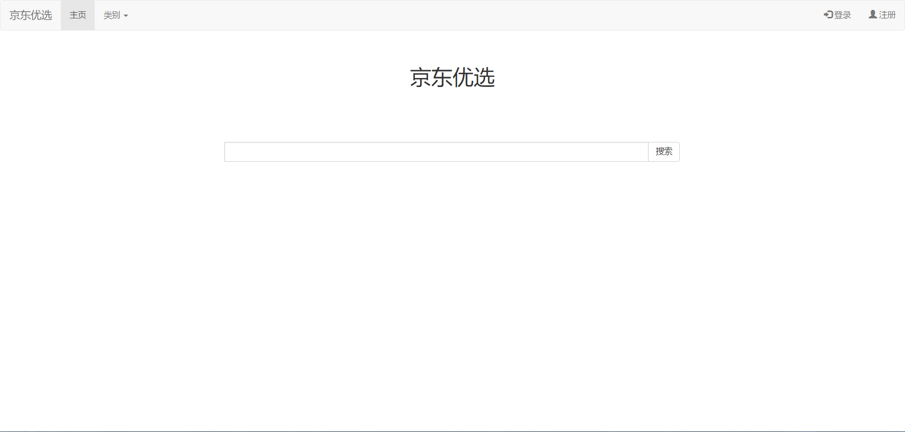
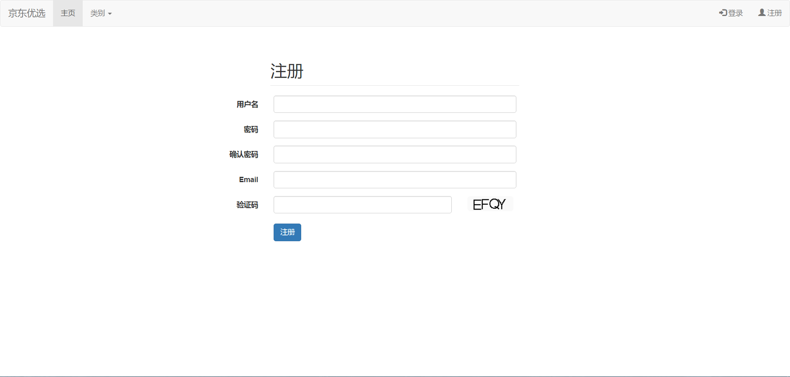
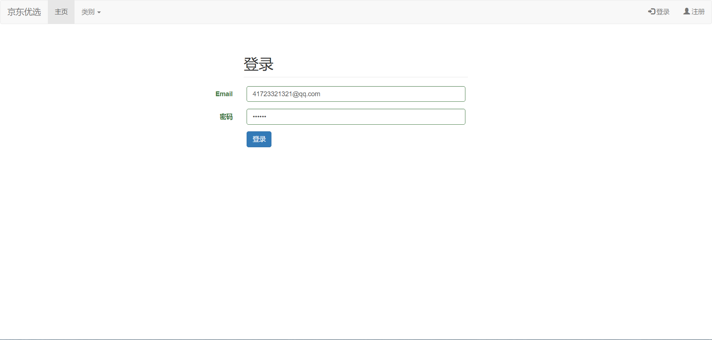
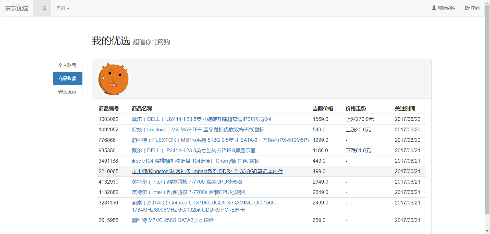

# PriceCompare
jingdong price compare

## 项目介绍
基于Spring+struts2+hibernate开发系统，爬取并展示京东商品价格，功能模块：爬虫模块、搜索引擎模块、用户模块、商品收藏模块、商品推荐模块，实现商品搜索，商品比价，推荐商品等功能。

### 技术选型

#### 后端技术:
技术 | 名称 | 官网
----|------|----
Spring Framework | 容器  | [http://projects.spring.io/spring-framework/](http://projects.spring.io/spring-framework/)
Struts | MVC框架  | [http://struts.apache.org/](http://struts.apache.org/)
Hibernate | ORM框架  | [http://hibernate.org/orm/](http://hibernate.org/orm/)
BootstrapValidator | 校验框架  | [https://github.com/psyked/bootstrapvalidator](https://github.com/psyked/bootstrapvalidator)
Lucene | 搜索引擎  | [http://lucene.apache.org/](http://lucene.apache.org/)
Webmagic | 爬虫框架  | [http://webmagic.io/](http://webmagic.io/)
jUnit | 单元测试框架  | [http://junit.org/junit4/](http://junit.org/junit4/)

#### 前端技术:
技术 | 名称 | 官网
----|------|----
jQuery | 函式库  | [http://jquery.com/](http://jquery.com/)
Bootstrap | 前端框架  | [http://getbootstrap.com/](http://getbootstrap.com/)
Echarts | 图标库  | [http://echarts.baidu.com/](http://echarts.baidu.com/)
Bootstrap-table | Bootstrap数据表格  | [http://bootstrap-table.wenzhixin.net.cn/](http://bootstrap-table.wenzhixin.net.cn/)
Font-awesome | 字体图标  | [http://fontawesome.io/](http://fontawesome.io/)
material-design-iconic-font | 字体图标  | [https://github.com/zavoloklom/material-design-iconic-font](https://github.com/zavoloklom/material-design-iconic-font)

#### 开发工具:
- MySql: 数据库
- Tomcat: 应用服务器
- SVN|Git: 版本管理
- IntelliJ IDEA: 开发IDE

### 预览图
- 主页

- 注册

- 登录

- 个人主页/商品收藏

